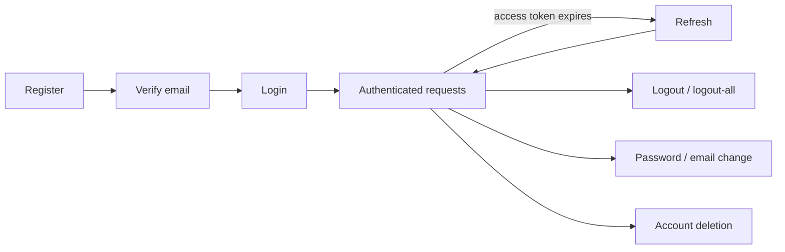

# Authentication & Account Lifecycle

An architectural walkthrough of the account lifecycle implemented in
`routes/auth.js`, `services/*Service.js`, and `models/userModel.js`. This is
intentionally architectural, not an endpoint reference — see `routes/auth.js`
for exact request/response contracts. Concrete security controls are in
`07-security.md`; the reasoning behind the token/session/concurrency choices
is in `08-authentication-engineering-decisions.md`.

## Lifecycle overview

## 1. Registration

`POST /register` (`authService.register`):

- Normalizes the email (lowercased) and hashes the password with bcrypt
  (`BCRYPT_SALT_ROUNDS`, default 12).
- Generates a hashed email-verification token (24h expiry).
- Creates the user row inside a transaction. Uniqueness is enforced twice: a
  `SELECT ... FOR UPDATE` pre-check, and the underlying `UNIQUE(email)`
  constraint (a duplicate-key insert is caught and turned into a normal
  conflict response) — so two concurrent registrations for the same email
  cannot both succeed.
- The account is created with `is_verified = false` and cannot log in until
  verified.
- On commit, a `USER_REGISTERED` event triggers the verification email
  asynchronously (see `01-engineering-standards.md`, "Email delivery").

## 2. Email verification

Two-step flow:

- `GET /verify-email` — checks token state without consuming it.
- `POST /verify-email/confirm` — consumes it, setting `is_verified = true`.

Token state is classified as `active` / `recently_consumed` / `expired` (see
`07-security.md` → Confirmation-token lifecycle). Confirming runs through an
idempotent-confirmation helper, so a resubmitted confirmation within the
5-minute idempotency window returns the same success outcome instead of an
error.

`POST /resend-verification` re-issues a token, gated by a 2-minute cooldown
measured from the previous token's issue time, and always returns a generic
"if an account exists..." message (see Decisions → enumeration resistance).

## 3. Login

`POST /login` (`authService.login`):

- Reads the account with `SELECT ... FOR UPDATE`, serializing concurrent
  login attempts against the same account.
- If the account is currently locked (`locked_until` in the future), the
  request fails immediately with 429 — the password is never checked.
- Otherwise the password is compared with `bcrypt.compare`. A failed compare
  increments `failed_login_count` and, once it reaches
  `MAX_FAILED_LOGIN_ATTEMPTS` (10), sets `locked_until` 15 minutes out. A
  successful compare clears both counters.
- Unverified accounts fail with 403 even with the correct password.
- A verified, successfully-authenticated login receives a new access token
  and refresh token (see below for the session-limit/cleanup work done at
  this point).

## 4. Access tokens

- Stateless JWTs (HS256, `JWT_SECRET`), 15-minute expiry, payload limited to
  `{ sub: userId }`.
- Verified per-request by the `authenticate` middleware, which also re-reads
  the user's current timezone/gender from the database on every request
  (never trusted from the token), so profile changes apply immediately.
- Never persisted server-side. Revocation is indirect: revoke the refresh
  token and let the short-lived access token expire naturally.

## 5. Refresh token lifecycle

- Issued alongside the access token at login: a random 40-byte value. The raw
  value goes to the client in an httpOnly cookie; only its SHA-256 hash is
  stored (`refresh_tokens.token_hash`).
- At login, before issuing the new token, the server clears the user's own
  expired password-reset token, deletes their expired refresh tokens, locks
  their active refresh tokens (`FOR UPDATE`), and evicts the oldest one(s) if
  already at the `MAX_ACTIVE_SESSIONS` (5) limit.
- `POST /refresh` rotates the token: the presented token is looked up by hash
  under `FOR UPDATE`, marked used, and a new row is inserted and linked back
  via `rotated_to_id`. See `08-authentication-engineering-decisions.md` for
  single-use rotation, reuse detection, and fixed-expiry behavior.
- `POST /logout` walks the `rotated_to_id` chain starting from the presented
  token and deletes every row in it, so a stale cookie that has since been
  rotated is still fully cleaned up.
- `POST /logout-all` deletes every refresh token for the user,
  unconditionally.

## 6. Password change / reset

- **Authenticated change** (`POST /change-password`): requires the current
  password, rejects a new password identical to the current one, and applies
  the update only if the stored hash still matches the hash read moments
  earlier (optimistic concurrency). Refresh tokens are revoked afterward.
- **Unauthenticated reset** (forgot → reset): `forgotPassword` always returns
  the same generic message and only emits a reset email if a verified
  account exists and a 15-minute cooldown has elapsed. `resetPassword`
  validates the token state, requires the email to match the token's
  account, and — like the authenticated flow — applies the new hash only if
  the password hasn't changed since the token was read. Refresh tokens are
  revoked afterward.

## 7. Email change

- **Request** (`PATCH /email`): requires the current password, no-ops if the
  new address equals the current one, and re-checks inside a transaction
  that the password hasn't changed and the new address isn't already taken
  (as anyone's primary or pending email) before issuing a change token,
  gated by the same 2-minute cooldown pattern.
- **Confirm** (`POST /verify-email-change/confirm`): requires the current
  password again, then atomically flips `email ← pending_email` only if no
  other account has claimed that address in the meantime (see `07-security.md`
  → Email-change race safety). Refresh tokens are revoked on success.
- Resend/cancel reuse the same cooldown/idempotency machinery.

## 8. Account deletion

- **Request** (`POST /delete-account/request`): issues a deletion token,
  gated by the same cooldown pattern, capped at 2 requests/hour.
- **Confirm** (`POST /delete-account/confirm`): uses the
  `authenticateAllowRecentlyDeleted` middleware instead of the standard
  `authenticate` middleware (see Decisions), requires the current password,
  and deletes the user's habits and the user row in one transaction. It also
  records the deletion separately in `account_deletion_confirmations` (see
  Decisions → account-deletion state survives user-row deletion), so a
  resubmitted confirmation, or a status check via
  `GET /delete-account/verify`, can still report "already deleted" after the
  user row is gone.

## 9. Logout / logout-all

Covered under Refresh token lifecycle above.

## 10. Request validation

Every mutating auth endpoint validates `req.body` (or `req.query` for
token-bearing `GET`s) against a Zod schema
(`middleware/schemas/authSchemas.js`) via `middleware/validate.js` before the
handler or service layer runs. Passwords are capped at 72 characters to match
bcrypt's effective input limit; emails are trimmed and lowercased before any
lookup or comparison.

## 11. Authorization & resource ownership

Every authenticated endpoint resolves the acting user from the verified JWT
(`req.user.id`) — never from a route parameter or request body — so one
authenticated user cannot act on another user's data by supplying a
different id. Ownership of non-account resources (habits) is additionally
enforced at the SQL layer: queries filter with `WHERE id = ? AND user_id = ?`
rather than fetching by id and checking ownership in application code. See
`07-security.md` → Authorization & ownership.
