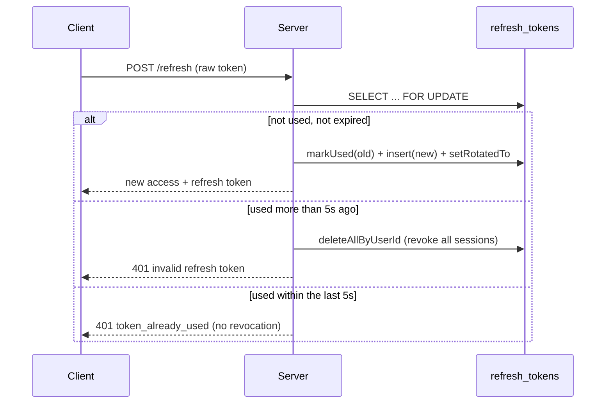

# Authentication Engineering Decisions

The reasoning behind the token, session, concurrency, and security choices in
the authentication system. See `06-authentication-and-account-lifecycle.md`
for the flow and `07-security.md` for the controls themselves.

## Token & session decisions

### Refresh tokens are single-use

**Decision:** Every `/refresh` call rotates the token: the presented token is
marked used and a new one is issued in its place (`sessionService.refresh`).
Reusing an already-used token outside a short grace window revokes every
refresh token the user has.

**Why:** A used token being presented again is the signature of a
stolen/duplicated token, not normal behavior. Treating it as a compromise
signal and revoking all sessions bounds the damage a leaked token can do,
rather than silently accepting the replay.

> _Implementation nuance:_ reuse within 5 seconds of the original use
> (`REUSE_GRACE_WINDOW_MS`) is treated as a benign duplicate request — e.g. a
> client retry racing the original — and returns an error without revoking
> anything. Only reuse after that window triggers full revocation
> (`refreshTokenModel.deleteAllByUserId`). This is narrower than "any reuse
> revokes everything," and exists to avoid punishing ordinary network
> retries.

### Refresh rotation does not extend the original lifetime

**Decision:** A rotated refresh token is inserted with the replaced token's
original `expires_at`, not a new full 50-day window.

**Why:** Without this, a client that refreshes regularly could keep a
session alive indefinitely. Inheriting the original expiry caps every
session at a fixed maximum lifetime regardless of how often it's refreshed.

### Maximum active sessions

**Decision:** A user can have at most `MAX_ACTIVE_SESSIONS` (5) active
refresh tokens. A new login beyond that limit evicts the oldest active
session first (`deleteOldestByUserId`, ordered by `created_at`).

**Why:** Bounds server-side session state per user and limits how many
long-lived, possibly-forgotten sessions (old devices, old browsers) can sit
around as standing attack surface.

## Confirmation-token decisions

### Confirmation-token state is explicit

**Decision:** Email verification, email change, password reset, and account
deletion tokens are classified into exactly three states — `active`,
`recently_consumed`, `expired` — by
`confirmationTokenService.classifyConfirmationToken`.

**Why:** Without a distinct "already handled" state, a retried or
double-clicked confirmation would be indistinguishable from a genuinely
invalid token, and would show the same "invalid or expired" error for
something that actually already succeeded.

### Email-change race safety

**Decision:** The final email swap (`markEmailChangeConsumed`) performs the
uniqueness check and the write in a single `UPDATE ... LEFT JOIN` statement
rather than a separate `SELECT` followed by an `UPDATE`.

**Why:** A check-then-write done as two statements leaves a window where two
concurrent confirmations could each pass the check before either writes,
letting two accounts claim the same email. Folding the check into the
`UPDATE`'s `WHERE` clause makes the whole operation atomic.

### Account deletion state survives user-row deletion

**Decision:** Confirming account deletion records a row in
`account_deletion_confirmations` (keyed by token hash and user id) in the
same transaction that deletes the `users` row, and that table is never
cascade-deleted from `users`.

**Why:** Once the user row is gone, there's nothing left to check "was this
token already used?" against. The separate record lets the system
distinguish "this account was deleted" (replay-safe, friendly message) from
"this account/token never existed" (a real error), and lets a still-valid
access token issued before deletion complete an idempotent confirmation
retry (see "idempotent re-authentication," below).

## Concurrency & consistency decisions

### Optimistic concurrency for security-sensitive updates

**Decision:** Password change and password reset condition their final
`UPDATE` on the password hash read earlier in the same flow
(`updatePasswordIfEligible`, `markResetTokenConsumedIfHashMatches`). Both
flows revoke all of the user's refresh tokens immediately after a successful
update.

**Why:** Prevents a stale request (e.g. a password-reset email confirmed
after the password was already changed through another path) from silently
overwriting newer state. Revoking refresh tokens afterward ensures a session
established under the old credential can't keep using a newly-changed
account.

### Rate limiting vs. login lockout

**Decision:** These are kept as two independent controls. Rate-limiting
middleware bounds request *volume* per IP/email; `failed_login_count` /
`locked_until` on the `users` row tracks authentication *failures* and locks
the account once `MAX_FAILED_LOGIN_ATTEMPTS` is reached. The lockout
check-and-update happens inside a transaction against a row read with
`SELECT ... FOR UPDATE`.

**Why:** Rate limiting resets on a fixed window and doesn't understand "this
specific account is under attack"; failure tracking alone doesn't bound raw
request volume. Together they cover both angles. The row lock is what
actually matters for correctness: without it, two concurrent guesses could
both read `failed_login_count` as 9 and both proceed, letting an attacker
slip past the threshold.

### Email sending is outside database transactions

**Decision:** Security-sensitive database changes commit first; the
corresponding email is triggered afterward through an event emitter
(`authEvents.emit(...)`), and delivery itself is fire-and-forget (see
`01-engineering-standards.md`).

**Why:** If delivery happened inside the transaction, a slow or failing SMTP
call would hold database locks open, and a delivery failure could roll back
a security operation that had already logically succeeded (e.g. a password
that actually was changed). Decoupling means the database state is always
the source of truth, independent of an external provider's availability.

### Cleanup of stale security data

**Decision:** Expired refresh tokens, consumed confirmation tokens, and
unverified accounts are removed by independently-scheduled background jobs,
not as a side effect of request handling.

**Why:** Request-time code should never depend on cleanup having run — auth
flows already treat expired/consumed data as invalid on their own. Cleanup
exists purely to bound table growth and reduce stale, security-relevant data
sitting in the database, on its own schedule.

## Additional decisions

### Access tokens and refresh-token persistence are architecturally separate

**Decision:** Access tokens are stateless, unpersisted JWTs (15-minute
expiry); refresh tokens are opaque random values, hashed, and persisted in
`refresh_tokens`.

**Why:** Keeps the hot path (verifying a request) fully stateless and
DB-free, while keeping the one long-lived credential — the refresh token —
revocable, which a stateless JWT can't be without an extra denylist
mechanism.

### Refresh tokens are hashed before storage

**Decision:** Only `sha256(token)` is stored (`utils/hashToken.js`); the raw
token exists solely in the client's cookie.

**Why:** A database read (backup, injection, misconfigured access) doesn't
hand over usable session credentials — the attacker would still need the
original random value, which they don't have.

### Refresh-token cookie is scoped and hardened

**Decision:** `httpOnly`, `sameSite: strict`, `secure` in production, and
`path: /api/auth`.

**Why:** `httpOnly` blocks script-based theft (XSS); `sameSite: strict`
blocks cross-site submission; the narrow `path` means the cookie isn't
attached to unrelated API requests, shrinking the set of endpoints that ever
see it.

### Enumeration-resistant responses for password reset and verification resend

**Decision:** `forgotPassword` and `resendVerification` always return the
same generic message ("if an account exists...") regardless of whether the
email exists, is already verified, or is on cooldown.

**Why:** An endpoint that responds differently for existing vs.
non-existent accounts lets an attacker enumerate valid emails one request at
a time. (Registration's "email already registered" response is a deliberate
exception, since the account's existence is the entire point of that error.)

### Login lockout blocks even a correct password

**Decision:** `login()` checks `locked_until` before comparing the password
at all — a correct password submitted during an active lockout still fails
with 429.

**Why:** If a correct password could bypass an active lockout, the lockout
would only ever stop an attacker who never finds the right password — a much
weaker guarantee than "this account is unreachable for the lockout window,
period."

### Idempotent re-authentication for account-deletion confirmation

**Decision:** `POST /delete-account/confirm` uses
`authenticateAllowRecentlyDeleted` instead of the standard `authenticate`
middleware. It accepts a still-valid access token whose user row no longer
exists, but only continues if a matching `account_deletion_confirmations`
row was recorded within the last 5 minutes.

**Why:** The access token issued before deletion is still cryptographically
valid for up to 15 more minutes, but the user it names no longer exists in
`users`. Standard `authenticate` would 401 a legitimate retry of the same
confirmation request; this middleware lets that retry through just far
enough to return an idempotent "already deleted" response, without granting
any broader access to a deleted account.

### Transactions retry automatically on lock contention

**Decision:** `runInTransaction` retries up to 3 times, with jittered
backoff, on `ER_LOCK_DEADLOCK` or `ER_LOCK_WAIT_TIMEOUT`.

**Why:** The auth flows lean heavily on `SELECT ... FOR UPDATE` for
correctness (login lockout, refresh rotation, email/password change). That
locking makes occasional lock contention or deadlocks under concurrent
access from the same account expected, not exceptional — retrying
automatically means a transient lock conflict doesn't surface to the user as
a hard failure.

### Fail-fast environment validation for security-critical configuration

**Decision:** `utils/validateEnv.js` checks required secrets/config and
exits the process on startup if anything is missing or invalid, including a
minimum `JWT_SECRET` length and an `https://` requirement for
`APP_BASE_URL` outside localhost.

**Why:** A missing or weak `JWT_SECRET`, or an `http://` link in a
production password-reset email, are the kind of misconfigurations that fail
silently and expensively in production. Refusing to start is cheaper than
discovering it after deployment.
