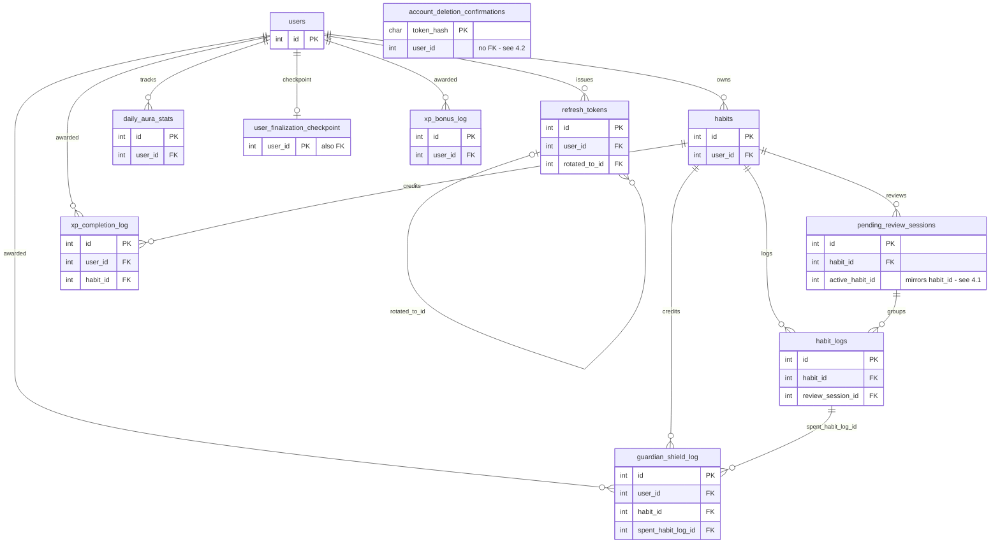

# Database Schema & ERD

This is a reference map of `schema.sql`: what each table is for, how the
tables connect, and — the part that doesn't survive in the DDL — **why**
each index exists. It's written for whoever is doing the next
scalability pass, so that pass starts from "here's what we already know"
instead of re-deriving intent from `git blame`.

Engine is MySQL 8.0 / InnoDB locally (`docker-compose.yml`). The documented
target production database is TiDB Cloud (see
`05-lifecycle-and-architecture.md`) — TiDB is MySQL-wire-compatible but
does **not** auto-create supporting indexes for foreign keys the way InnoDB
does (see §4). Anything in §4 that leans on that InnoDB behavior should be
re-verified against TiDB before being relied on there.

Related reading: `05-lifecycle-and-architecture.md` (derived-state
philosophy — several columns here exist only as rebuildable caches) and
`09-review sync and finalization.md` (the write pattern that most of the
`habit_logs` / `pending_review_sessions` indexes exist to serve).

---

## 1. Entity-Relationship Diagram

Two edges are deliberately **not** real foreign keys even though they look
like they should be: `account_deletion_confirmations.user_id` and
`pending_review_sessions.active_habit_id`. Both are explained in §4.

---

## 2. Tables

### `users`

**Purpose:** account identity/auth, plus a set of cached progression
totals that are rebuilt from ledger tables rather than trusted forever
(see §4.3).

| Column | Type | Notes |
|---|---|---|
| `id` | PK | |
| `email` | UNIQUE | |
| `password_hash`, `password_changed_at` | | |
| `is_verified`, `email_verification_*` | | verification token flow |
| `reset_token_*` | | password reset flow |
| `delete_token_*` | | account deletion flow |
| `pending_email`, `email_change_*` | | email change flow |
| `failed_login_count`, `locked_until` | | login lockout |
| `total_xp`, `current_level`, `global_daily_streak`, `last_full_completion_date`, `shield_balance` | | **cached**, recomputed from `xp_completion_log`/`xp_bonus_log`/`daily_aura_stats`/`guardian_shield_log` — not sources of truth |
| `timezone`, `timezone_source` | | day-boundary source of truth; not retroactive on change (`01-engineering-standards.md`) |
| `username`, `username_changed_at`, `gender` | | profile |

**Indexes and why:**

| Index | Columns | Why |
|---|---|---|
| `idx_users_email_verification_token_hash` | `email_verification_token_hash` | every verify-email hit is `WHERE email_verification_token_hash = ?` (`userModel.findVerificationTokenState`) |
| `idx_users_reset_token_hash` | `reset_token_hash` | same pattern for password reset (`findResetTokenState`) |
| `idx_users_delete_token_hash` | `delete_token_hash` | same pattern for account deletion (`findDeleteTokenState`) |
| `idx_users_email_change_token_hash` | `email_change_token_hash` | same pattern for email change (`findEmailChangeTokenState`) |
| `idx_users_pending_email` | `pending_email` | added in `0a74aaf` so `findByEmailOrPendingEmailForUpdate`'s `WHERE email = ? OR pending_email = ?` isn't a scan on the second branch — `email` already had its own unique index, `pending_email` didn't |
| `idx_users_unverified_cleanup` | `(is_verified, created_at)` | added in `86eb21a` for `cleanupUnverified.js`'s `WHERE is_verified = false AND created_at < cutoff` — a daily job, but on the users table so it was worth a composite rather than leaning on `is_verified` alone |

Four independent single-purpose token-hash columns (verify / reset /
delete / email-change) rather than one generic `tokens` table — each flow
queries its own column directly, so each gets its own narrow index instead
of a shared composite that would need a `token_type` discriminator.

### `account_deletion_confirmations`

**Purpose:** idempotency record for the "confirm account deletion" step —
lets a retried confirmation request recognize "already done" instead of
erroring, after the `users` row it referred to is gone.

**Indexes and why:**

| Index | Columns | Why |
|---|---|---|
| PK | `token_hash` | direct lookup by `findByHash` |
| `idx_account_deletion_confirmations_user_id` | `user_id` | supports `findRecentByUserId` (`WHERE user_id = ? ORDER BY consumed_at DESC LIMIT 1`) — declared explicitly because, per §4.2, this column has no FK to auto-create one |
| `idx_account_deletion_confirmations_consumed_at` | `consumed_at` | supports the retention sweep, `deleteOlderThan` (`cleanupConsumedConfirmationTokens.js`) |

### `habits`

**Purpose:** one row per user habit, plus **materialized** streak values
(`current_streak`, `longest_streak`) so dashboard reads don't have to
replay `habit_logs` (see §4.4).

| Column | Type | Notes |
|---|---|---|
| `id` | PK | |
| `user_id` | FK → `users.id`, **no `ON DELETE` clause** (defaults to `RESTRICT`) — see §4.5 | |
| `title`, `difficulty` | | |
| `archived_at` | | soft-delete; most reads filter `archived_at IS NULL` |
| `shield_deferred_since` | | set while a shield milestone is held back by an open pending review (`04-guardian-shield.md`) |
| `current_streak`, `longest_streak` | | materialized in `db605d7`, replacing a full `habit_logs` replay on every `GET /habits` and `GET /habits/:id` |

**Indexes and why:** none declared explicitly. `user_id` gets an
**implicit** InnoDB index because it's a FK column with no other index
covering it — see §4 before assuming per-user habit lookups
(`findAllByUser`, `countByUser`, `getEarliestCreatedAt`) are unindexed.

### `pending_review_sessions`

**Purpose:** groups one or more consecutive missed days for a habit into
a single open review (`02-streaks-and-pending-reviews.md`), so the app can
ask "what happened on these days?" once instead of per-day.

| Column | Notes |
|---|---|
| `habit_id` | real FK → `habits.id`, `ON DELETE CASCADE` |
| `status` | `active` \| `resolved` |
| `last_missed_date` | high-water mark, extended via `GREATEST()` as more misses land in the same open session |
| `active_habit_id` | **not a real relationship** — see §4.1 |

**Indexes and why:**

| Index | Columns | Why |
|---|---|---|
| `unique_active_session_per_habit` | `active_habit_id` | enforces "at most one active session per habit" — see §4.1 for how |
| implicit (FK) | `habit_id` | auto-created; no explicit index leads with `habit_id` |

### `habit_logs`

**Purpose:** the actual source-of-truth event log — one row per
`(habit, date)` outcome. Almost everything else in the schema is derived
from this table plus the ledgers below.

| Column | Notes |
|---|---|
| `habit_id` | FK → `habits.id`, `ON DELETE CASCADE` |
| `status` | `pending` \| `completed` \| `pending_review` \| `recovered` \| `shielded` \| `missed` |
| `review_session_id` | FK → `pending_review_sessions.id`, `ON DELETE SET NULL` |

**Indexes and why:**

| Index | Columns | Why |
|---|---|---|
| `unique_habit_date` | `(habit_id, log_date)` | enforces one outcome per habit per day; also the natural covering index for `findByHabitAndDate`, and satisfies the FK-support requirement for `habit_id` |
| `idx_habit_logs_status_habit_date` | `(status, habit_id, log_date)` | added in `2d0775e`. Almost every pending-review query filters `status = 'pending_review'` first (`findPendingForUser`, `findPendingByHabit`, `hasStaleReviewsForUser`, `expireStaleReviewsForUser`, `resolvePendingReviewsForHabit`) — leading with the low-cardinality `status` column lets MySQL jump straight to the pending slice instead of scanning a habit's whole history, with `habit_id`/`log_date` narrowing further within it |

`review_session_id` gets an **implicit** FK-support index (no explicit
index leads with it).

### `refresh_tokens`

**Purpose:** rotating refresh-token chain for sessions; each row is
single-use, and reuse of an already-`used_at` token is the signal for
"stolen token, kill the chain."

| Column | Notes |
|---|---|
| `user_id` | FK → `users.id`, `ON DELETE CASCADE` |
| `rotated_to_id` | self-FK → `refresh_tokens.id`, `ON DELETE SET NULL` — links a used token to the token it was rotated into |
| `used_at` | null until consumed once |

**Indexes and why:**

| Index | Columns | Why |
|---|---|---|
| UNIQUE | `token_hash` | direct lookup on every refresh (`findByTokenHashForUpdate`) |
| `idx_refresh_tokens_expires_at` | `expires_at` | added in `0a74aaf` for `cleanupExpiredTokens.js`'s `DELETE ... WHERE expires_at < NOW()` |
| `idx_refresh_tokens_user_used` | `(user_id, used_at)` | added in `27d95f9` ("prevent refresh race and stale session counting") — backs `countActiveByUserId` / `deleteExpiredForUser` / `deleteOldestByUserId`, all filtered by `user_id` with `used_at` as the second predicate; also satisfies the FK-support requirement for `user_id` |
| `idx_refresh_tokens_rotated_to_id` | `rotated_to_id` | added in `740e03a` ("close logout and refresh race conditions") — explicit rather than relying on InnoDB's implicit index, likely so the intent is visible in the DDL |

### `daily_aura_stats`

**Purpose:** one row per `(user, day)` — the rebuildable source of truth
for lifetime stats, level, and the *global* (cross-habit) streak, as
opposed to per-habit streaks which live on `habits` (`05-lifecycle-and-architecture.md`).

**Indexes and why:**

| Index | Columns | Why |
|---|---|---|
| `unique_user_date` | `(user_id, stat_date)` | one row per user per day; also the upsert target for `upsertCounts` |
| `idx_user_full_completion` | `(user_id, full_completion, stat_date)` | supports `getFullCompletionDates(UpTo)` (`WHERE user_id = ? AND full_completion = true ORDER BY stat_date`) used to derive the global streak, without scanning every tracked day for users who miss habits often |

### `user_finalization_checkpoint`

**Purpose:** one row per user, tracking the last date lazy finalization
has fully processed (`09-review sync and finalization.md`). Split out from
`daily_aura_stats` in `c8567f0` because that table's "yesterday fallback"
checkpoint didn't survive a day with zero recorded activity.

`user_id` is the primary key — this is a genuine 1:1 with `users`, not a
1:many, which is why it isn't a surrogate-`id` table like the others.

### `xp_bonus_log`

**Purpose:** ledger of `7day` / `30day` consistency bonus awards. Existence
of a row *is* the "already awarded" check — there's no separate flag.

**Indexes and why:**

| Index | Columns | Why |
|---|---|---|
| `unique_user_bonus_awarded` | `(user_id, bonus_type, awarded_at)` | prevents double-awarding the same bonus for the same day, and is the exact shape of `hasBonusBeenAwarded`'s lookup and `findAwardsFromDate`'s range scan |

### `xp_completion_log`

**Purpose:** per-completion XP ledger; `total_xp` on `users` is the
running sum, this table is what it's summed from on rebuild.

**Indexes and why:**

| Index | Columns | Why |
|---|---|---|
| `unique_habit_log_date` | `(habit_id, log_date)` | one XP award per habit per day; also the lookup key for `findAward`/`deleteAward` |

`user_id` gets an **implicit** FK-support index — `unique_habit_log_date`
leads with `habit_id`, not `user_id`, so it doesn't cover the FK, and
InnoDB adds a single-column one behind the scenes. That implicit index is
what `sumByUser`'s `WHERE user_id = ?` actually runs on.

### `guardian_shield_log`

**Purpose:** ledger of earned/spent Guardian Shields (`04-guardian-shield.md`).
`shield_balance` on `users` is a cached count of `status = 'available'`
rows here.

| Column | Notes |
|---|---|
| `habit_id` | FK → `habits.id`, `ON DELETE CASCADE` — the habit that *earned* the shield |
| `spent_habit_log_id` | FK → `habit_logs.id`, `ON DELETE SET NULL` — the (possibly different) habit's log entry it was *spent* on, since shields are a shared wallet (§ Guardian Shield doc) |

**Indexes and why:**

| Index | Columns | Why |
|---|---|---|
| `unique_habit_milestone_streak` | `(habit_id, milestone, streak_start_date)` | prevents re-awarding the same milestone for the same streak run; backs `hasMilestoneBeenAwarded` and `findAwardsFromDate` |

`user_id` gets an **implicit** FK-support index (not covered by the
composite above, which leads with `habit_id`) — this is what
`findOldestAvailableForUser` and `countAvailable` run their `user_id = ?`
filter against; `status` is filtered after, not part of any index.
`spent_habit_log_id` also gets an implicit FK-support index.

---

## 3. Cascade behavior

| FK | On delete | Notes |
|---|---|---|
| `habits.user_id → users.id` | **RESTRICT** (default — no clause) | App-level ordering required; see §4.5 |
| `pending_review_sessions.habit_id → habits.id` | CASCADE | |
| `habit_logs.habit_id → habits.id` | CASCADE | |
| `habit_logs.review_session_id → pending_review_sessions.id` | SET NULL | |
| `refresh_tokens.user_id → users.id` | CASCADE | |
| `refresh_tokens.rotated_to_id → refresh_tokens.id` | SET NULL | |
| `daily_aura_stats.user_id → users.id` | CASCADE | |
| `user_finalization_checkpoint.user_id → users.id` | CASCADE | |
| `xp_bonus_log.user_id → users.id` | CASCADE | |
| `xp_completion_log.user_id → users.id` | CASCADE | |
| `xp_completion_log.habit_id → habits.id` | CASCADE | |
| `guardian_shield_log.user_id → users.id` | CASCADE | |
| `guardian_shield_log.habit_id → habits.id` | CASCADE | |
| `guardian_shield_log.spent_habit_log_id → habit_logs.id` | SET NULL | |
| `account_deletion_confirmations.user_id` | — | not a real FK at all; see §4.2 |

Because `habits.user_id` has no `ON DELETE` action, every caller that
deletes a `users` row deletes that user's `habits` first, in the same
transaction — `accountDeletionService.confirmAccountDeletion` and
`scripts/cleanupUnverified.js` both call `habitModel.deleteAllByUser`
immediately before `userModel.deleteById`. Once `habits` rows are gone,
`habit_logs`, `pending_review_sessions`, `xp_completion_log`, and
`guardian_shield_log` cascade from `habits.id` automatically — only the
`users → habits` leg needs the explicit app-level step.

---

## 4. Patterns worth knowing before you touch this schema

### 4.1 `active_habit_id` is not a foreign key

MySQL has no partial/filtered unique index, so "at most one **active**
review session per habit" (habit_id can repeat across *resolved*
sessions, just not across two *active* ones) can't be expressed as a
plain `UNIQUE (habit_id)`. `active_habit_id` is a column that mirrors
`habit_id` while a session is active and is set to `NULL` on resolve
(`pendingReviewSessionModel.create` inserts it equal to `habit_id`;
`resolve`/`resolveIfNoPending` null it out). Because MySQL treats multiple
`NULL`s in a unique index as distinct rather than conflicting, the
`UNIQUE KEY unique_active_session_per_habit (active_habit_id)` only ever
actually constrains the *active* rows. It looks like a second relationship
to `habits` in the DDL; it isn't one.

### 4.2 `account_deletion_confirmations.user_id` has no FK on purpose

This table's entire job is to still say "yes, this was already confirmed"
after the `users` row it refers to has been deleted. A FK with `CASCADE`
would delete the confirmation record along with the user (defeating the
idempotency check on a retried request); a FK with `RESTRICT` would block
the user deletion outright. So there's no FK — `user_id` is a plain
indexed column, not a relationship the database enforces.

### 4.3 Several `users` columns are caches, not sources of truth

`total_xp`, `current_level`, `global_daily_streak`,
`last_full_completion_date`, and `shield_balance` are all written by
`xpModel`/`userProgressModel` as **denormalized** projections of
`xp_completion_log` + `xp_bonus_log` (XP/level) and `daily_aura_stats`
(global streak), and `guardian_shield_log` (shield balance). This is the
"derived state philosophy" from `05-lifecycle-and-architecture.md`: fast
to read, cheap to keep in sync incrementally, but safe to fully rebuild
from the ledger tables if a write path ever drifts. If you're auditing for
correctness bugs (as opposed to scan/index issues), the ledger tables are
the ones to trust — these `users` columns are only ever as correct as the
last write that touched them.

### 4.4 `habits.current_streak` / `longest_streak` are the same pattern

Added in `db605d7` specifically to stop `GET /habits` and
`GET /habits/:id` from reading and replaying full `habit_logs` history on
every request (`0c5165c`). They're kept current by the same write paths
that already touch a habit (check-in, undo, review resolution), not
recomputed from `habit_logs` on read anymore.

### 4.5 Not every FK column has a visible index — InnoDB fills the gap silently

InnoDB requires every FK column to be covered by *some* index and will
silently create a plain single-column one if no explicit index has that
column as its leftmost part. `schema.sql` never spells these out, so
reading the DDL literally undersells what's actually indexed. As of this
schema, the columns relying on an **implicit** index rather than an
explicit `KEY` line are:

- `habits.user_id`
- `pending_review_sessions.habit_id`
- `habit_logs.review_session_id`
- `xp_completion_log.user_id`
- `guardian_shield_log.user_id`
- `guardian_shield_log.spent_habit_log_id`

Two things follow from this. First, don't add a redundant explicit index
on any of these expecting a speedup — one already exists, it's just not
named in the file. Second, this is InnoDB-specific behavior; if the
production TiDB migration mentioned in `05-lifecycle-and-architecture.md`
ever actually happens, these six columns are the ones to check for
missing coverage, since TiDB doesn't auto-create them the same way.

---

## 5. Queries without a matching index — worth an `EXPLAIN` before the next pass

These aren't necessarily wrong today — none of them sit on a per-request
hot path, they run on `cleanupRunner.js`'s background schedule — but
they're the most likely to become visible as `users` grows, and nobody's
confirmed their actual query plan:

- **`cleanupConsumedConfirmationTokens.js` — runs every 5 minutes.** Three
  of its four `UPDATE users ...` statements filter on
  `email_verification_consumed_at`, `email_change_consumed_at`, and
  `reset_token_consumed_at` respectively — none of these three columns
  has any index, explicit or implicit. This is the most concrete
  candidate in the schema for a genuine full scan of `users` on a fixed,
  frequent cadence.
- **`cleanupExpiredTokens.js`'s used-token sweep** —
  `DELETE FROM refresh_tokens WHERE used_at IS NOT NULL AND used_at < cutoff`
  doesn't specify `user_id`, so it can't use the leftmost-prefix of
  `idx_refresh_tokens_user_used (user_id, used_at)`; it runs hourly against
  the whole table.
- **The other four `cleanupExpiredTokens.js` statements** (reset,
  email-verification, delete-token, email-change token clearing) filter on
  `..._expires` / `is_verified`, columns that overlap only partially with
  the existing token-hash and `idx_users_unverified_cleanup` indexes —
  plausibly fine given `IS NOT NULL` selectivity on mostly-null columns,
  but that's an assumption, not something confirmed against a real query
  plan here.

None of these showed up in the `perf(db)` commits, which were all about
per-request paths (pending-review checks, dashboard reads, token
verification). They're background-job scans that haven't needed attention
yet because the jobs are cheap relative to their interval — but "cheap
relative to interval" is exactly the kind of assumption that breaks
quietly as the `users` table grows, so they're worth an `EXPLAIN` before
ruling them out.
