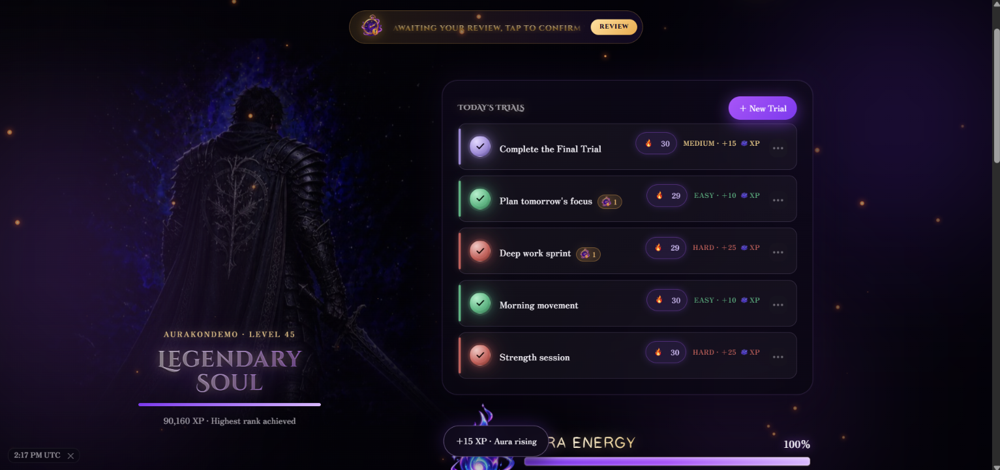
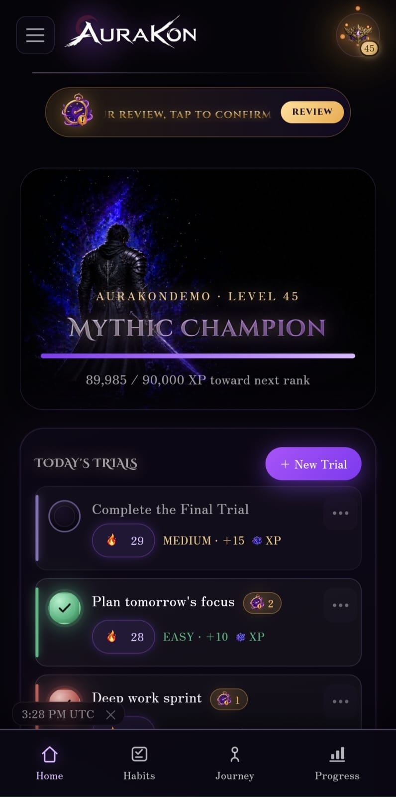
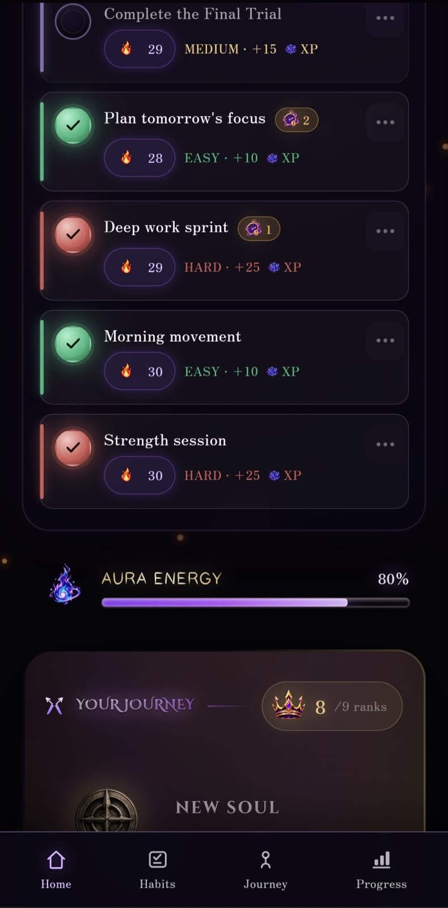
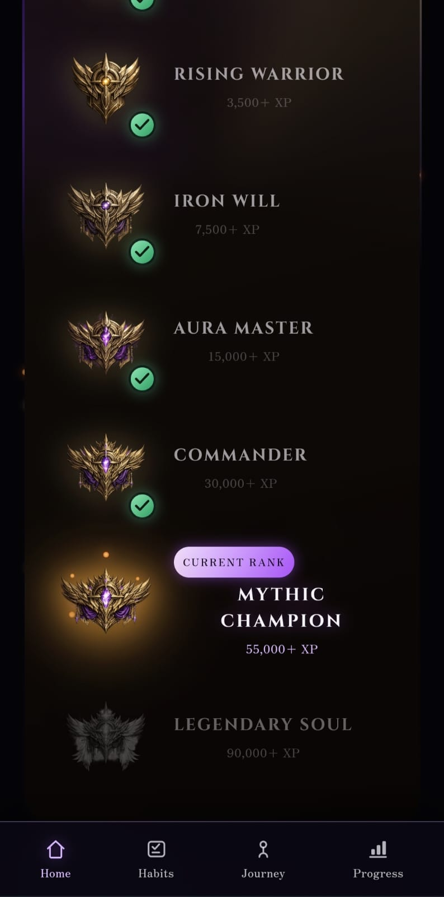
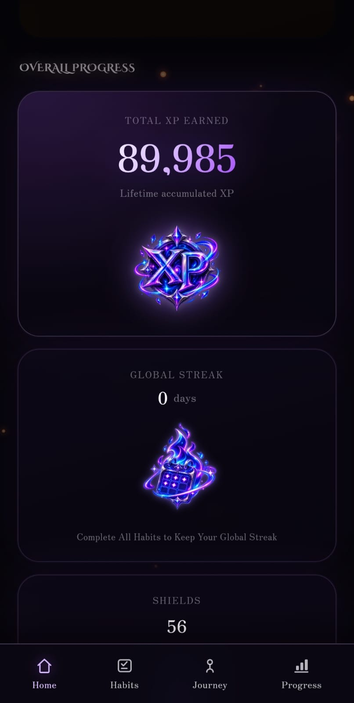
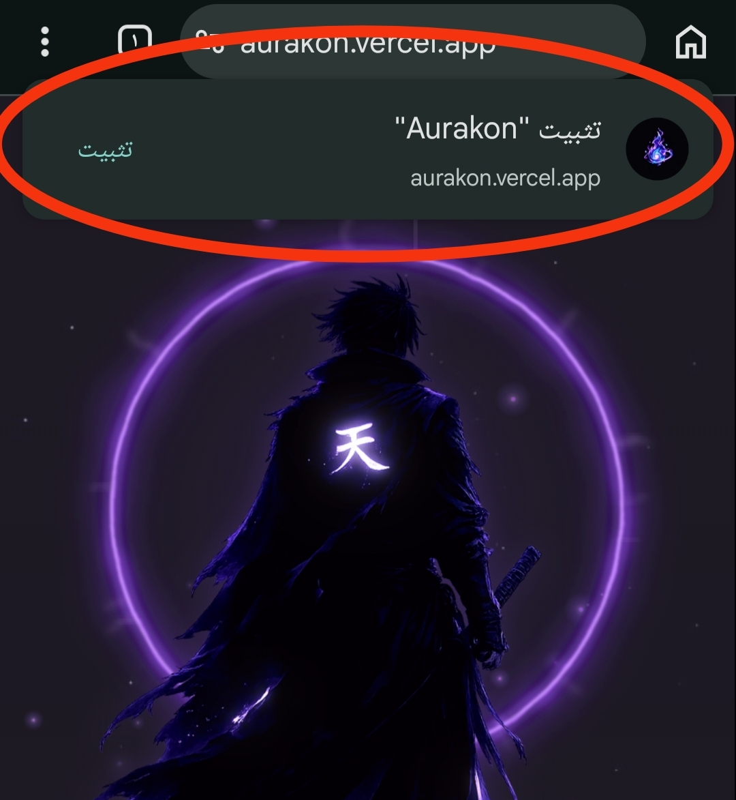
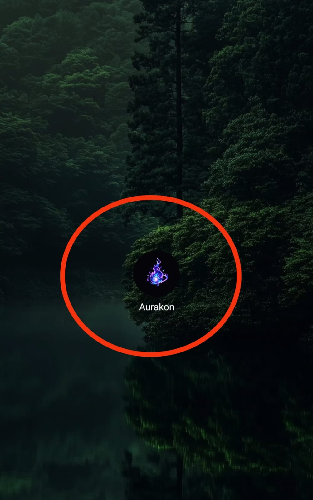
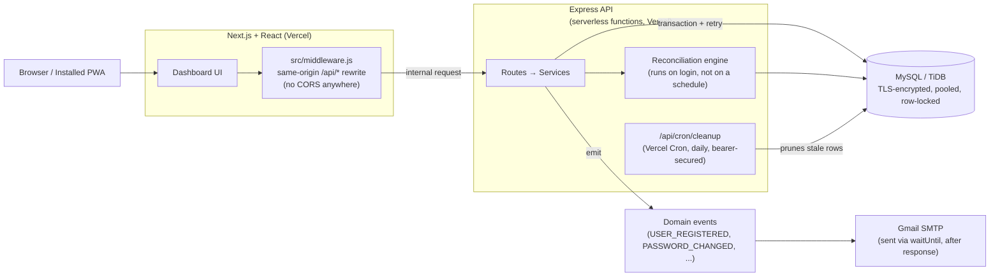
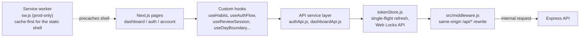

<div align="center">
  

  <p><em>Build yourself, protect your streak, and grow your Aura.</em></p>

  <h3><a href="https://aurakon.vercel.app/">🔗 Go to Aurakon</a></h3>

  <br/>

  
  
  
  
  
  
</div>

<br/>

Aurakon turns personal consistency into a warrior's progression journey. Every habit a user keeps feeds a character that levels up, unlocks ranks, and grows an Aura, backed by a real progression system underneath: XP and streak tracking, a shared economy of earnable shields, a review process for days that don't go as planned, and a full account and security system.

<p align="center">
  <sub>A project by</sub><br>
  <strong>SAIF AHMED</strong><br>
  <a href="https://www.linkedin.com/in/saifahmed-sw">LinkedIn</a>
</p>

## Table of Contents

- [At a Glance](#at-a-glance)
- [Preview](#preview)
- [Features](#features)
  - [Progression & Rewards](#progression--rewards)
  - [Pending Reviews & Guardian Shields](#pending-reviews--guardian-shields)
  - [Auth & Security](#auth--security)
  - [A Reconciliation Engine Instead of a Scheduler](#a-reconciliation-engine-instead-of-a-scheduler)
  - [Installable, Responsive PWA](#installable-responsive-pwa)
  - [Transactions & Race Conditions](#transactions--race-conditions)
- [Architecture](#architecture)
- [Testing & Verification](#testing--verification)
- [Documentation](#documentation)
- [Running It Locally](#running-it-locally)
  [Copyright & Usage](#copyright--usage)

## At a Glance

- **Aurakon is a gamified routine consistency platform** that turns daily routines into a progression system built around XP, levels, ranks, streaks, stats, Aura energy, bonuses, and recovery mechanics.
- **Designed for real-world consistency:** missed days, reviews, streak recovery, progression changes, and edge cases are handled explicitly rather than assuming users always follow the happy path.
- **Built for concurrent, reliable state changes:** progression writes use transactions, explicit row locking, deadlock retries, and database-level constraints to protect data integrity under concurrent requests.
- **Security is treated as a system, not a feature:** rotating refresh tokens with replay detection, multi-layer rate limiting, password protection, security headers, and race-condition handling protect the authentication flow.
- **A real desktop + mobile experience:** responsive behavior is complemented by dedicated layouts, shared application state, PWA installation, and offline-aware behavior.
- **Production-oriented architecture:** no cron-dependent progression logic, bounded and resumable reconciliation, managed database-pool lifecycle, asynchronous email delivery, and serverless deployment on Vercel.

## Preview

<p align="center">
  
</p>

<p align="center">
  
</p>
<p align="center"><sub><em>The desktop dashboard, today's trials, XP, rank, and Aura Energy in one warrior scene.</em></sub></p>

<table>
  <tr>
    <td width="38%" align="center">
      
      <br/><sub><em>Mobile layout</em></sub>
    </td>
    <td width="62%" align="center">
      
      <br/><sub><em>Checking in a trial, XP, Aura Energy, rank and character update live, no page reload</em></sub></td>
  </tr>
</table>

<table>
  <tr>
    <td width="33%" align="center">
      
      <br/><sub><em>Aura Energy and the start of the rank ladder</em></sub>
    </td>
    <td width="33%" align="center">
      
      <br/><sub><em>The full journey, nine ranks, current one highlighted</em></sub>
    </td>
    <td width="33%" align="center">
      
      <br/><sub><em>Overall progress, lifetime XP, global streak, and shield balance</em></sub>
    </td>
  </tr>
</table>

## Features

### Progression & Rewards

**The XP economy is built to resist gaming, not just to award correctly:** habit creation is capped per day and per level, and deleting a habit reverses that day's XP rather than letting a create-and-delete cycle farm rewards. Completing a habit awards XP based on how hard it is (10 for easy, 15 for medium, 25 for hard), and every award is logged permanently so a user's total can always be rebuilt from history instead of trusted as a number that could drift. XP drives a nine-tier title system, from "New Soul" up to "Legendary Soul" at 90,000 XP, and a level that takes lifetime completions, lifetime consistency, and current streak into account — levels only ever go up, and higher levels unlock room for more active habits. A daily Aura Energy score reflects how much of the day's plan got done, and hitting a 7-day or 30-day streak earns a stacking XP bonus.

<p align="center">
  
</p>
<p align="center"><sub><em>Every one of the nine ranks, New Soul to Legendary Soul, has its own emblem and illustrated warrior stage, for both character variants.</em></sub></p>

---

### Pending Reviews & Guardian Shields

Missing a day doesn't just count as a loss. It opens a 48-hour window to resolve it as recovered, shielded, or missed, and if the same habit is missed several days in a row, those days are grouped into a single review instead of piling up separately. Guardian Shields back this up: they're earned automatically at streak milestones (every 30 days on hard habits, every 45 on medium ones), shared across all of a user's habits rather than tied to one, and spent automatically to protect a missed day (without handing out completion XP for it). If a later correction shows a shield or bonus shouldn't have been granted, the system walks that change back through and keeps everything consistent.

<p align="center">
  
</p>
<p align="center"><sub><em>Recovered, self reporting a day that was actually done</em></sub></p>

<p align="center">
  
</p>
<p align="center"><sub><em>Shielded, offered automatically when a shield is available</em></sub></p>

<p align="center">
  
</p>
<p align="center"><sub><em>Confirming the spend, one shield, no completion XP</em></sub></p>

---

### Auth & Security

<p>    </p> 
 <br/>

- Every mutating auth request is validated by a **Zod schema** before it reaches the service layer.
- Passwords are hashed with **bcrypt (cost factor 12)** and never stored, logged, or compared as plaintext.
- Sessions run on a two-token model: a **15-minute JWT access token** carrying nothing but the user id, re-checked against the database on every request, plus a **40-byte opaque refresh token** that rotates on every use and is stored only as a **SHA-256 hash** — so a leaked database never hands over a usable token.
- The browser never talks to the backend directly: a Next.js middleware rewrites every `/api/*` request server-side to the backend's internal address, so the app has a single origin end-to-end. That's also why there's **no CORS layer anywhere in the stack** — and why the refresh-token cookie can stay `httpOnly`, `secure`, and strictly same-site with its path scoped to `/api/auth`, instead of needing a cross-origin exception.
- If an already-rotated refresh token is replayed, the system treats it as theft and signs every session on the account out at once — with a narrow exception: reuse within a 30-second grace window, before the token's rotated-to child has itself been used, is treated as an ordinary client retry rather than theft, so a flaky network doesn't trigger a mass logout.
- A user can hold at most **5 concurrent sessions**; logging in on a sixth device evicts the oldest one, and a dedicated logout-all endpoint revokes every session on the account at once.
- Repeated failed logins lock an account for **15 minutes after 10 attempts**, with the failure counter read and updated inside a `SELECT ... FOR UPDATE` transaction so concurrent login attempts against the same account can't race past the lockout.
- A second, independent layer of rate limiting, keyed by IP, by email, and by user id, stacks two or three deep on the most sensitive endpoints (login, password reset, account deletion), so an attacker can't dodge one limiter by spreading requests across accounts or IPs.
- Authorization never trusts a route parameter or request body: the caller's identity always comes from the verified JWT, and resource ownership is enforced at the **SQL layer** (`WHERE id = ? AND user_id = ?`) rather than fetched and checked after the fact.
- Email verification, email change, password reset, and account deletion all share a confirmation-token lifecycle with a short **idempotency window**, so a duplicate click or a retried request resolves to the same success instead of an error — and a stale change is rejected with a conflict rather than silently overwritten if the account changed in the meantime.
- A valid session is never enough on its own to change or destroy the account: password changes, and the final confirmation step for both email changes and account deletion, each require re-entering the **current password**, re-checked again inside the transaction against the hash read earlier so a password changed mid-flow invalidates the pending action instead of letting it through.
- Password changes, password resets, email changes, and account deletions each fire an automatic notification email to the account, independent of the session that made the change, so a user is alerted if their account changes without them.
- **Helmet** applies a restrictive Content-Security-Policy (`default-src 'self'`, `script-src 'self'`) and standard security headers to every response.
- The frontend carries its own independent header hardening rather than inheriting the API's: a CSP, `Strict-Transport-Security` (with `preload`), `X-Frame-Options: DENY`, and a `Permissions-Policy` that disables camera, microphone, and geolocation are all set at the Next.js layer, so the pages themselves are locked down the same way the API responses are.

On top of that engineering, the account system covers what a real product needs day to day:

- Email verification before first login
- Self-service password reset and change
- A two-step email-change flow
- Safeguarded account deletion
- Self-service username and timezone changes — usernames are throttled with their own cooldown, independent of the request-level rate limiters above; timezone defaults to auto-detected but can be overridden from account settings
- A one-time, permanent character selection at signup, enforced server-side: no other endpoint is reachable until it's set
- A one-click disposable demo account for trying the app without signing up for real — each session gets its own isolated account that expires and cleans itself up automatically

---

### A Reconciliation Engine Instead of a Scheduler

Nothing in Aurakon depends on a background job to stay correct. If a user disappears for a month, nothing quietly breaks while they're gone. The next time they log in, the app catches up in real time: it finalizes every day left undecided and reconciles streaks, bonuses, and shields before the page even finishes loading. That process is safe to run more than once, so a retried request, a restarted server, or two tabs open at once all land on the same result. Catch-up is also bounded rather than one unbounded replay: a persisted per-user checkpoint tracks exactly how far reconciliation has progressed, so a user gone for months resumes from that watermark instead of rescanning their full history, and the work itself runs in fresh, short-lived transactions capped at 30 days per batch rather than one long-held lock.

The frontend follows the same rule. It never treats its own guess as final: every action checks back in with the server afterward, and if something changes in the background that the user didn't directly cause (a shield getting reclaimed, for instance), that change is shown to them rather than applied quietly.

Every "day" in that reconciliation is the user's own day, not the server's: boundaries are computed against each user's actual IANA timezone rather than server-local midnight, so a streak lands on the correct date no matter where the user is. The frontend mirrors this: it schedules a precise timer for the user's own local midnight, with a `visibilitychange` fallback for tabs that were backgrounded past it, so the dashboard turns over to the new day live, no refresh required.

---

### Installable, Responsive PWA

Aurakon ships as a full PWA rather than a plain webpage. A web app manifest makes it installable with its own name, standalone display mode, and maskable icons, and a scoped service worker registers itself only in production builds so local development is never confused by stale caches. The service worker deliberately caches nothing dynamic: it pre-caches the static shell (fonts, icons, the manifest) and app assets with a cache-first strategy, leaves every `/api/*` call and anything carrying credentials untouched so the backend stays the single source of truth, and always goes to the network for page navigations, falling back to a dedicated offline page only when a request genuinely fails.

The dashboard is a real dual layout rather than one design squeezed to fit smaller screens: desktop renders a full-bleed warrior scene, mobile swaps in a compact character card, and both are driven from the exact same progression props so they can never fall out of sync with each other. Breakpoints step the HUD, typography, and spacing down through tablet and phone widths, and every ambient animation respects `prefers-reduced-motion`, so the game-y visual layer doesn't come at the cost of accessibility.

<table>
  <tr>
    <td width="33%" align="center">
      
      <br/><sub><em>Install prompt (mobile)</em></sub>
    </td>
    <td width="33%" align="center">
      
      <br/><sub><em>Installed (its own home-screen icon)</em></sub>
    </td>
    <td width="33%" align="center">
      
      <br/><sub><em>Install prompt (desktop)</em></sub>
    </td>
  </tr>
</table>

---

### Transactions & Race Conditions

Every write that touches progression state (completing a habit, resolving a pending review, spending or earning a shield) runs inside a **MySQL transaction**, never a sequence of independent queries.

**Two requests for the same account can never overwrite each other's work:** before any per-user derived value (level, streak, daily aura stats) is recalculated, the engine takes an explicit row lock (`SELECT ... FOR UPDATE`) on that user, so a retried request, a background reconciliation racing a live check-in, or two tabs open at once all serialize instead of clobbering each other.

A deadlock or lock wait timeout triggers an **automatic retry** (up to 3 attempts, with jittered backoff) instead of surfacing a transient error to the user; any other failure rolls back cleanly and propagates immediately.

**A reward can't be double-credited even if the lock above somehow gets bypassed:** every reward-granting write also carries its own idempotency backstop at the database layer — XP completions, streak bonuses, and Guardian Shield awards are each protected by a unique constraint (`unique_habit_log_date`, `unique_user_bonus_awarded`, `unique_habit_milestone_streak`), and the services that write to them catch the resulting `ER_DUP_ENTRY` and treat it as a no-op rather than an error.

Reconciliation always rebuilds derived numbers from source records rather than trusting an incremental counter, so replaying the same finalization twice produces the same result, which is what makes it safe to retry in the first place.

**Not every race is solved with a lock.** Password changes and resets apply their final update conditioned on the password hash read earlier in the same request (`WHERE id = ? AND password_hash = ?`), so a password changed mid-request returns a conflict instead of silently overwriting newer state. Email changes go further: the final swap runs as a single `UPDATE ... LEFT JOIN` statement that checks the new address is still unique and performs the write in the same statement, so two users can never race each other into claiming the same email.

**The frontend has its own version of this problem, and its own fix:** refresh tokens are single-use, so two tabs refreshing at the same instant would look like token replay to the backend. `tokenStore.js` resolves it with the browser's native **Web Locks API** (falling back to a `localStorage` lock plus `BroadcastChannel` leader election on browsers that lack it), so one tab performs the real refresh while the others simply wait on it. A narrower race is guarded separately: every authenticated request silently refreshes and retries once on an expired access token, but first snapshots a logout generation counter, so a stale retry is discarded instead of completing a state-mutating request after the user has already logged out.

---

## Architecture



The backend is a Node.js and Express REST API, split into focused services rather than one large router, sitting on top of a relational MySQL schema reached over a TLS-encrypted connection with optional custom CA verification. Every sensitive write happens inside a transaction with row locking and automatic retries, and every important number (level, streak, total XP, shield balance) is rebuilt from source records instead of tracked as a running total. It runs as serverless functions rather than a long-lived server, which is also what keeps progression itself scheduler-free as described above — the one scheduled job in the stack is a daily Vercel Cron hitting an authenticated `/api/cron/cleanup` endpoint, and it only prunes rows past a time window (expired demo accounts, stale tokens, and the like), so nothing progression-related depends on it; the MySQL pool's lifecycle across those short-lived invocations is managed by `@vercel/functions`'s `attachDatabasePool` rather than left to leak connections between calls, and the same package's `waitUntil` keeps a function alive just long enough to finish sending transactional email in the background after the response has already returned. Services never call the email layer directly: auth flows emit a domain event (`USER_REGISTERED`, `PASSWORD_CHANGED`, and so on) and a single listener module owns delivery, with each event carrying a correlation ID derived from the relevant token so an individual email send can be traced back to the security event that triggered it.

The server also fails fast instead of starting in a broken state: a missing environment variable, a too-short JWT secret, or a non-HTTPS `APP_BASE_URL` outside localhost all abort startup immediately. In the long-lived Docker deployment, it shuts down the same way it starts up carefully — draining in-flight requests, stopping the background cleanup jobs, and closing the database pool before exiting on SIGINT/SIGTERM.

The frontend is a Next.js and React app, shipped as an installable PWA, styled with a hand-built system rather than a UI framework. It represents the backend's numbers visually: a warrior that levels up through nine illustrated stages per character, a nine-rank emblem ladder, and a daily view for XP, streaks, shields, and pending reviews. Every value it shows comes from the server; nothing is estimated on the frontend. State lives in a set of focused custom hooks (`useHabits`, `useAuthFlow`, `useReviewSession`, `useDayBoundary`, among others) rather than a global state library, with a dedicated API layer (`authApi.js`, `dashboardApi.js`) and the `tokenStore.js` described above keeping every server call, retry, and token refresh out of the components themselves.



Local development runs the entire stack (database, backend, frontend) with a single Docker Compose command. Both images use multi-stage builds and run as a non-root user, and the backend image ships with a `HEALTHCHECK` wired to a dedicated `/api/health` endpoint.

---

## Testing & Verification

Aurakon is backed by a suite of custom Node test harnesses in [`/tests`](tests), run directly against the real API and database rather than against mocks — only the email transport is mocked, so no real SMTP call goes out during a run. Each harness shares a small `check(name, actual, expected)` assertion helper that logs a PASS/FAIL line per check and exits with a non-zero code if anything fails, and each one seeds its own fixtures and tears them down afterward so a run stays repeatable. Across the suite that's **200+ individual checks**, plus a standalone data-integrity script (`Verifystreaksync.js`) that recomputes every stored streak from its source `habit_logs` rows and flags any drift from the stored value — the same "rebuild from source, don't trust a running total" principle the reconciliation engine itself relies on.

Coverage includes:

- **Progression edge cases** — XP, leveling, and title-tier boundaries (`test-progression-edge-cases.js`, `progression-harness.js`)
- **Streaks & timezones** — streak math and day-boundary handling across timezones (`test-streak.js`, `test-timezoneSafety.js`)
- **Pending reviews** — the 48-hour resolution window and multi-day grouping (`test-pendingReviewSessionRules.js`, `test-reviewWindow.js`)
- **Habit limits** — per-day and per-level creation caps (`test-habitLimitRules.js`)
- **Auth & account flows** — domain-event emission and the email-change race/idempotency behavior described above (`test-authEvents.js`, `test-emailChange.js`)
- **Dashboard integration** — an end-to-end pass against seeded users through the real dashboard API (`e2e-dashboard-integration.js`, `e2e-seed-users.js`)

This sits alongside manual regression passes on the actual UI. Each concurrency, authentication, security, and correctness issue found during hardening was reproduced against the real application and database, fixed, and then retested — through the harness where one existed, by hand otherwise — to confirm both the fix and the absence of regressions. On the frontend specifically, this manual pass is what covers the responsive breakpoints, the PWA install and offline flows, and the service worker's production-only registration — none of which a Node harness can exercise.

---

## Documentation

The `/Docs` directory holds the project's internal engineering documentation: fourteen living documents that go deeper than belongs here.

**Backend & product logic:**

- [Engineering standards and conventions](Docs/01-engineering-standards.md)
- [Streak calculation and pending-review rules](Docs/02-streaks-and-pending-reviews.md)
- [Progression, XP, and reward mechanics](Docs/03-progression-and-rewards.md)
- [Guardian Shield rules and reconciliation](Docs/04-guardian-shield.md)
- [System lifecycle, trust boundaries, and deployment architecture](Docs/05-lifecycle-and-architecture.md)
- Authentication & account lifecycle, plus the security controls and the reasoning behind them: [account lifecycle](Docs/06-authentication-and-account-lifecycle.md) · [security controls](Docs/07-security.md) · [engineering decisions](Docs/08-authentication-engineering-decisions.md)
- [The review-sync and finalization engine](<Docs/09 -review sync and finalization.md>)
- [Database schema & ERD](Docs/10-database-schema-and-erd.md)
- [Full API reference](<Docs/11 -API_REFERENCE.md>)

**Frontend:**

- [Frontend/backend reconciliation contract](Docs/12-frontend-backend-reconciliation-contract.md)
- [Frontend architecture](Docs/13-frontend-architecture.md)
- [Frontend & UI/UX gamification design](Docs/14-frontend-and-ui-gamification.pdf)

## Running It Locally

```bash
git clone https://github.com/saif-ahmedcs/Aurakon.git
cd Aurakon
cp .env.example .env   # fill in DB credentials, JWT_SECRET, Gmail SMTP creds
docker compose up --build
```

The backend starts on `:3000` and the frontend on `:3001`. See `.env.example` and `Docs/05-lifecycle-and-architecture.md` for configuration details and the intended production topology. `CRON_SECRET` is the one exception worth calling out: it authenticates Vercel's daily cron hit on `/api/cron/cleanup` in production and isn't used by the Docker setup at all, so it can be left blank for local development.

---

## Copyright & Usage

> **© 2026 Saif Ahmed. All rights reserved.**
>
> This project and its source code are proprietary. No part of this project may be copied, modified, distributed, published, sublicensed, or used in whole or in part without explicit written permission from the author.
>
> For contribution requests, feature proposals, or other collaboration inquiries, please contact [saif.ahmed.softw.engineer@gmail.com](mailto:saif.ahmed.softw.engineer@gmail.com).
